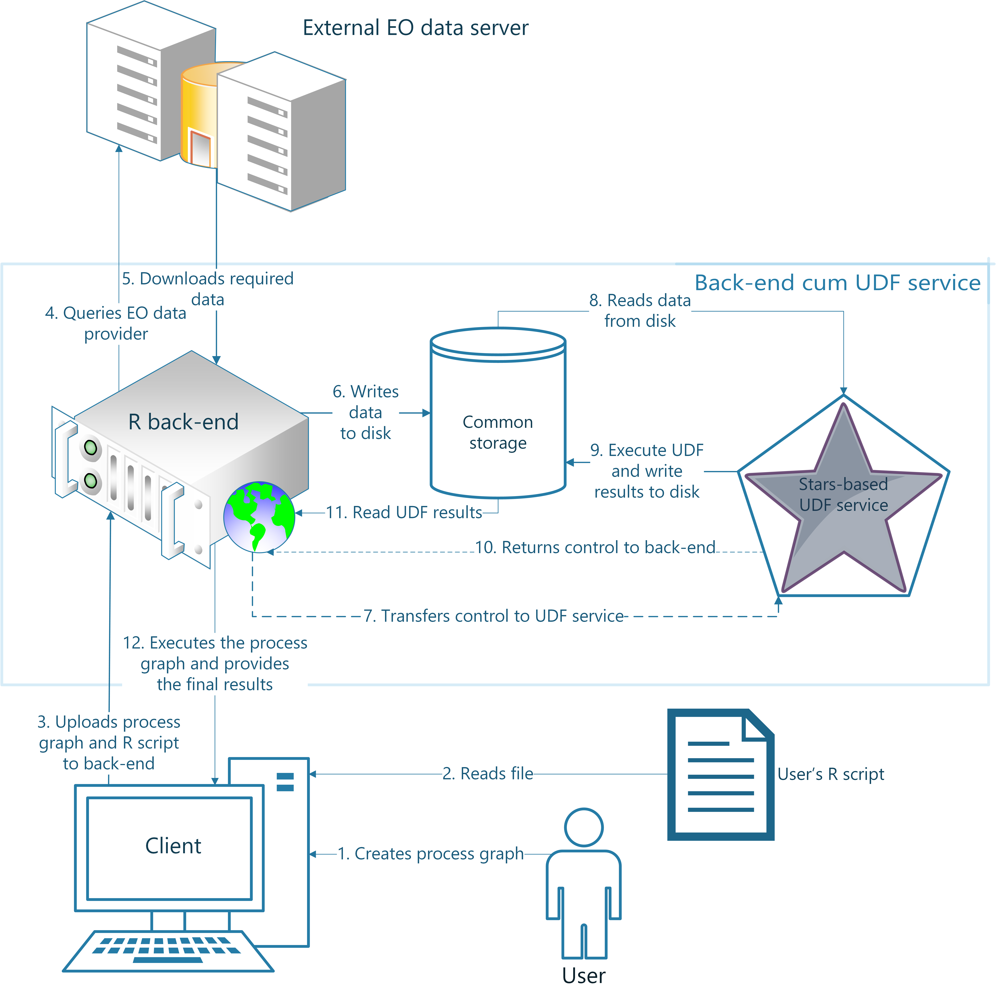

```{r setup, include = FALSE}
knitr::opts_chunk$set(
  collapse = TRUE,
  fig.path = "man/figures/",
  comment = "#>"
)
```

## Introducing the file-based R UDF service

### Overview of Strategy
```{r echo=FALSE, out.width="700px"}

```

### Background
The file-based R UDF service works on the concept that it is possible to have a common storage space which is accessible feasibly by both the backends as well as the R UDF service. Then, when a UDF is encountered in the process graph by the backend, it writes the intermediate results to that disk in the form of generic GeoTIFF files along with a look-up table (in the form of a CSV file) which contains information on which file corresponds to which time-step and band along with some redundant information such as their spatial and temporal extents. Control is transferred to the user's UDF script file which would then

* load this library using

```{r eval=FALSE, include=FALSE}
library(openEO.R.UDF)
```
* define his/her custom function
```{r eval=FALSE, include=FALSE}
custom_function = function(obj)
{
    median(obj)
}
```
and pass the function name as an argument to the function `run_UDF()` which is defined in the package `openEO.R.UDF`. Here `obj` is a list of numbers obtained from using `st_apply()` on a stars object with a `MAR` argument to define the dimension the function is to be applied on. For example,

```{r eval=FALSE, include=FALSE}
run_UDF(function_name = custom_function, legend_name = "legend.csv", drop_dim = 4)
```
Here, `legend_name` refers to the name of the look-up table and `drop_dim` refers to the dimension the function is to be applied over. `drop_dim = 3` refers to the dimension for `band` while `drop_dim = 4` refers to `time`.

### Corresponding R "backend"

This release shows the use of User Defined Functions (UDFs) in R in the context of the OpenEO project. OpenEO.R.UDF is a R package and currently integrates with the "backend" implementation by @flahn in R here: <https://github.com/Open-EO/openeo-r-backend/>.

## Code for demo

Working example:

* Install required packages
   Install the packages "openeo-r-backend", "openeo" and "openEO.R.UDF"
```{r echo=TRUE, eval=FALSE}
     library(devtools)
     install_github("Open-EO/openeo-r-backend", ref = "feature/udf_develop")
     install_github("Open-EO/openeo-r-client")
     install_github("pramitghosh/OpenEO.R.UDF")
    ```
* Start the backend server and load demo data
```{r eval=FALSE, echo=TRUE}
    library(openEO.R.Backend)
    createServerInstance()
    openeo.server$workspaces.path = "<path/to/workspace/directory here>"
    openeo.server$initEnvironmentDefault()
    openeo.server$initializeDatabase()

    # Creating a user for the first time...
    # openeo.server$createUser(user_name = "<username here>", password = "<password here>")

    openeo.server$loadDemo() #Loads demo data
    openeo.server$startup(port = 8000) #Starts up local server on port 8000
```
* Login and execute process using the R client
```{r eval=FALSE, echo=TRUE}
    library(openeo)
    conn = connect(host = "http://127.0.0.1:8000/api/", user = "<registered username here>", password = "<password here>", rbackend = T) #Login using credentials
    conn %>% listProcesses() #Should show a list of available processes including `aggregate_time`

    # Upload UDF script file in R to the server from the local working directory
    # (e.g. <https://github.com/pramitghosh/OpenEO.R.UDF/blob/master/data/example_udf/sample_udf.R>)
    uploadUserData(conn, content = "../backend/sample_udf.R", target = "/script.R")
    #Check to make sure the file "script.R" is listed to be present on the server
    conn %>% listFiles()

    # Create process graph starting with
    # Sentinel-2 data -> Temporal filtering -> Applying UDF of type `aggregate_time` to find the median along the time axis for all the 13 bands
    task = collection("sentinel2_subset", id_name = "product_id") %>%
    process(process_id = "filter_daterange", prior.name = "imagery", from = "2017-05-01", to = "2017-06-20") %>%
    process(process_id = "aggregate_time", prior.name = "imagery", script = "/script.R")
    conn %>% executeTask(task = task, format = "GTiff", output_file = "out.tif") #Executes the process graph
```
The output file is to be found in the workspace directory that was defined. The end of processing could be observed when the message "Task result was sucessfully stored." appears on the console running the client.